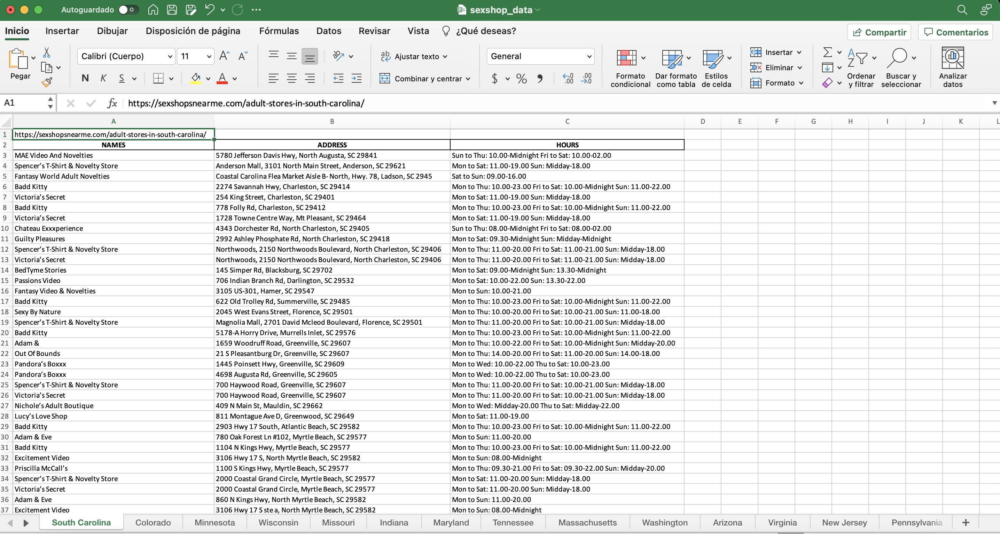

# sexshop_scraper
A web scraper to obtain the information from SexShopNearMe website. 
This scraper is based in the next [UpWork project requirement](https://www.upwork.com/jobs/~01f95563985d5ef56f).

## Technologies used:
* Python
* Requests module
* scrapy module
* pandas

## How to run:
1. git clone https://github.com/TUDz/sexshop_scraper
2. cd sexshop_extractor
3. python3 -m venv venv (Generate a virtual environment)
4. source venv/bin/activate (Activate virtual environment)
5. python3 -m pip install -r requirements.txt (Install dependencies)

